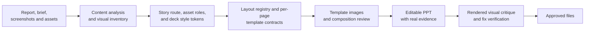

# Competition PPT Template-First Skill

[](skills/competition-ppt-template-first/SKILL.md)
[](skills/competition-ppt-template-first/references/workflow.md)
[](skills/competition-ppt-template-first/references/quality-gates.md)
[](LICENSE)
[](https://skills.sh/che626/competition-ppt-template-first-skill)
[](https://github.com/che626/competition-ppt-template-first-skill/stargazers)

> Start by deciding what the deck must communicate and what must visibly appear on every page, then make the important parts editable.

Chinese documentation: [README.zh-CN.md](README.zh-CN.md)

`competition-ppt-template-first` is a reusable Agent Skill for competition, product, and technical PPTs. It replaces the usual "dark background + generic components + tiny text" workflow with a content-to-template sequence: analyze the material, choose the story, define each page's layout and visual ingredients, generate a bespoke whole-slide background template for that exact page, then build the editable deck.



The template image carries composition, atmosphere, material, light, and visual detail. The editable PPT layer carries the factual claim, real screenshots, charts, certificates, and the text the user may need to update. Before page production, the Skill locks a deck token system, assigns every image a truth-aware role, and registers the layout rhythm across the deck. Every page is planned first: content grouping, background scene or quiet surface, primary visual, supporting visual ingredients, real-image slots, and text zones. Then every content page receives a bespoke whole-slide template image generated from that plan. Dense technical pages still receive a quieter generated template, not a flat or card-only exception. Cover and closing pages use separate hero/conclusion template rules.

## Two Practical Levels

Start with the level that matches the material on hand:

| Level | Best for | What to do |
| --- | --- | --- |
| `Core workflow` | A topic, brief, a few screenshots, or an existing deck. | Analyze the desired outcome, story type, and visual ingredients; define a template contract for every page; build editable slides and check readability. |
| `Report-grounded workflow` | A report, paper, data workbook, award evidence, or technical package. | Add a source manifest, content analysis, fact registry, slide-source map, and per-page template contracts for claims that need proof. |

Both levels follow the same visual method. The report-grounded level adds traceability where numbers, model comparisons, awards, and technical claims need to withstand questions. Neither level defaults to a dark-blue cyber style: palette, background scene, product/material cues, and light/dark distribution are selected from the subject.

## Report-Grounded Deck Mode

Feed the project package, not just a topic. The skill converts source documents into a traceable defense route before it designs a page:

```text
report / proposal / requirements / data / screenshots
  -> source manifest
  -> content analysis: deck type, audience, story, visual ingredients, gaps
  -> usable facts and source links for key claims
  -> judge-facing narrative
  -> page/template contracts
  -> representative template
  -> editable defense PPT
```

Use it when the deck must stay faithful to a `.docx`, PDF, technical report, research paper, data workbook, or competition brief. Keep a precise source locator for metrics, comparisons, awards, and other claims likely to be challenged. Read [`content-to-template-analysis.md`](skills/competition-ppt-template-first/references/content-to-template-analysis.md) and [`source-ingestion.md`](skills/competition-ppt-template-first/references/source-ingestion.md) for the complete option.

## Why Template-First

| Conventional AI PPT | Template-first competition PPT |
| --- | --- |
| Starts with rectangles, cards, and text boxes | Starts with facts, a page argument, and a full-slide art direction |
| Reuses one layout until the deck becomes flat | Holds a stable visual system while varying slide archetypes |
| Uses generated images as fake proof | Reserves prominent zones for authentic screenshots and artifacts |
| Pursues full editability and accepts mediocre composition | Keeps critical facts editable while preserving a high-completion visual underlay |
| Repairs rejected pages with more overlays | Rebuilds the entire underlay when the template is structurally wrong |

## Install

Use any Skill-compatible agent installer, or copy `skills/competition-ppt-template-first/` into the agent's skills directory. For installers based on the community `skills` CLI:

```bash
npx -y skills@latest add che626/competition-ppt-template-first-skill \
  --skill competition-ppt-template-first \
  --agent codex \
  --global
```

The skill entry point is [`skills/competition-ppt-template-first/SKILL.md`](skills/competition-ppt-template-first/SKILL.md). It is designed for Codex, Claude Code, Cursor, and other agents that recognize Agent Skills.

Maintainers can validate installer discovery before a release with:

```powershell
.\skills\competition-ppt-template-first\scripts\validate-distribution.ps1
```

Use `-Remote` after publishing to test the GitHub clone path as well.

## Use It

Attach the report, evidence images, and any reference deck, then use a prompt such as:

```text
$competition-ppt-template-first
Read the project report and create an 11-page AI-vision competition defense deck.
Use the supplied screenshots as real evidence. First produce a content-to-deck analysis,
the story route, and a template contract for every page: background scene, primary visual,
real-image slots, text zones, supporting visual ingredients, and avoid list. Then make one
representative template-first page for approval.
```

More copy-ready prompts are in [`prompt-recipes.md`](skills/competition-ppt-template-first/examples/prompt-recipes.md).

To initialize the standard report-grounded workspace:

```text
python skills/competition-ppt-template-first/scripts/init-report-grounded-deck.py ./my-competition-deck --source-folder ./project-materials
```

## What the Skill Produces

```text
competition-ppt/
  00_intake/     source manifest, extraction notes, image asset roles, original-asset references
  00_plan/       content analysis, fact registry, deck brief, style tokens, layout registry, slide-source map, page blueprints
  01_templates/  approved 16:9 template images and prompt records
  02_build/      editable PPTX work files
  03_renders/    exported previews, rendered visual critique, and QA notes
  04_approved/   explicitly confirmed pages
  99_retired/    rejected variants kept for traceability
```

The full folder convention is documented in [`project-conventions.md`](skills/competition-ppt-template-first/references/project-conventions.md).

## Included Playbook

| Resource | Purpose |
| --- | --- |
| [`SKILL.md`](skills/competition-ppt-template-first/SKILL.md) | Agent execution contract and mode selection |
| [`workflow.md`](skills/competition-ppt-template-first/references/workflow.md) | Fact-to-deck production method |
| [`content-to-template-analysis.md`](skills/competition-ppt-template-first/references/content-to-template-analysis.md) | Turns reports and user goals into a story route, visual inventory, and per-page template decisions |
| [`source-ingestion.md`](skills/competition-ppt-template-first/references/source-ingestion.md) | Document intake, traceable fact extraction, and defense-route construction |
| [`layout-archetypes.md`](skills/competition-ppt-template-first/references/layout-archetypes.md) | Competition-specific page structures |
| [`prompt-library.md`](skills/competition-ppt-template-first/references/prompt-library.md) | Prompt patterns for visual templates |
| [`quality-gates.md`](skills/competition-ppt-template-first/references/quality-gates.md) | Rendered PPT acceptance checks |
| [`deck-token-system.md`](skills/competition-ppt-template-first/references/deck-token-system.md) | Deck-level color, type, spacing, image, and contrast controls |
| [`image-asset-roles.md`](skills/competition-ppt-template-first/references/image-asset-roles.md) | Truth-aware image roles and screenshot framing rules |
| [`rendered-visual-critique.md`](skills/competition-ppt-template-first/references/rendered-visual-critique.md) | Composition, hierarchy, density, and typography critique method |
| [`deck-brief.md`](skills/competition-ppt-template-first/templates/deck-brief.md) | Deck-level planning template |
| [`deck-style-tokens.md`](skills/competition-ppt-template-first/templates/deck-style-tokens.md) | Deck token control sheet |
| [`image-asset-register.md`](skills/competition-ppt-template-first/templates/image-asset-register.md) | Image truth role and transformation register |
| [`layout-registry.md`](skills/competition-ppt-template-first/templates/layout-registry.md) | Page rhythm and layout-family registry |
| [`rendered-visual-critique.md`](skills/competition-ppt-template-first/templates/rendered-visual-critique.md) | Render-review record and fix-verification log |
| [`content-analysis.md`](skills/competition-ppt-template-first/templates/content-analysis.md) | Required analysis of deck type, audience decision, visual ingredients, style rationale, and gaps |
| [`source-manifest.md`](skills/competition-ppt-template-first/templates/source-manifest.md) | Inventory of reports, requirements, data, and assets |
| [`slide-source-map.md`](skills/competition-ppt-template-first/templates/slide-source-map.md) | Page-by-page mapping from source facts to judge conclusions |
| [`slide-blueprint.md`](skills/competition-ppt-template-first/templates/slide-blueprint.md) | Per-page content and layout blueprint |
| [`revision-record.md`](skills/competition-ppt-template-first/templates/revision-record.md) | Feedback-to-structural-revision log |
| [`ai-vision-defense-example.md`](skills/competition-ppt-template-first/examples/ai-vision-defense-example.md) | A generic 11-page AI vision map |

## Design Position

Clear before ornate. Use scenes, materials, real visual evidence, product context, light, and typographic scale when they help the page. Keep dense pages calm and readable; keep low-text pages more visual. Avoid generic cyberpunk frames, repeated rounded-card walls, fake UI screenshots, darkened stock photos behind cards, illegible generated text, and body copy reduced to microscopic size.

## Scope and Limits

- Best for innovation, AI, robotics, engineering, research, and product-defense decks.
- It is not a generic slide-template library or an automatic corporate-branding system.
- It does not invent metrics, achievements, or product capabilities.
- It intentionally keeps complex visual underlays as images when that is the best way to preserve quality; this is not the same as dropping a finished slide screenshot into PowerPoint.
- It is a working method, not a promise that every project needs cinematic visuals, source tables, or a complicated production pipeline.
- It does not treat the word "AI" as a reason to make every page black, navy, cyan, or HUD-like. The visual system must be justified by the project subject and the page role.

## Contributing

Read [CONTRIBUTING.md](CONTRIBUTING.md) before opening an issue or proposing an archetype. The repository accepts generalized, rights-cleared workflows and examples only; do not submit private project evidence.

## License

MIT. This repository contains no project screenshots, certificates, or proprietary competition material.
