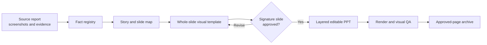

# Competition PPT Template-First Skill

[](skills/competition-ppt-template-first/SKILL.md)
[](skills/competition-ppt-template-first/references/workflow.md)
[](skills/competition-ppt-template-first/references/quality-gates.md)
[](LICENSE)
[](https://skills.sh/che626/competition-ppt-template-first-skill)
[](https://github.com/che626/competition-ppt-template-first-skill/stargazers)

> A high-end competition deck should be **art-directed first, editable where it matters**.

Chinese documentation: [README.zh-CN.md](README.zh-CN.md)

`competition-ppt-template-first` is a reusable Agent Skill for high-stakes competition and defense PPTs. It replaces the usual "dark background + generic components + tiny text" workflow with a reliable sequence:



The template image carries composition, atmosphere, material, light, and visual detail. The editable PPT layer carries the factual claim, real screenshots, charts, certificates, and the text the user may need to update.

## New: Report-Grounded Deck Mode

Feed the project package, not just a topic. The skill converts source documents into a traceable defense route before it designs a page:

```text
report / proposal / requirements / data / screenshots
  -> source manifest
  -> fact registry with section and page locators
  -> slide-source map
  -> judge-facing narrative
  -> signature slide
  -> editable defense PPT
```

Use it when the deck must stay faithful to a `.docx`, PDF, technical report, research paper, data workbook, or competition brief. Read [`source-ingestion.md`](skills/competition-ppt-template-first/references/source-ingestion.md) for the full contract.

## Why Template-First

| Conventional AI PPT | Template-first competition PPT |
| --- | --- |
| Starts with rectangles, cards, and text boxes | Starts with facts, a page argument, and a full-slide art direction |
| Reuses one layout until the deck becomes flat | Holds a stable visual system while varying slide archetypes |
| Uses generated images as fake proof | Reserves prominent zones for authentic screenshots and artifacts |
| Pursues full editability and accepts mediocre composition | Keeps critical facts editable while preserving a high-completion visual underlay |
| Repairs rejected pages with more overlays | Rebuilds the entire underlay when the template is structurally wrong |

## Install

Use any Skill-compatible agent installer, or copy `skills/competition-ppt-template-first/` into the agent's skills directory. For installers based on the community `skills` CLI:

```bash
npx -y skills@latest add che626/competition-ppt-template-first-skill \
  --skill competition-ppt-template-first \
  --agent codex \
  --global
```

The skill entry point is [`skills/competition-ppt-template-first/SKILL.md`](skills/competition-ppt-template-first/SKILL.md). It is designed for Codex, Claude Code, Cursor, and other agents that recognize Agent Skills.

Maintainers can validate installer discovery before a release with:

```powershell
.\skills\competition-ppt-template-first\scripts\validate-distribution.ps1
```

Use `-Remote` after publishing to test the GitHub clone path as well.

## Use It

Attach the report, evidence images, and any reference deck, then use a prompt such as:

```text
$competition-ppt-template-first
Read the project report and create an 11-page AI-vision competition defense deck.
Use the supplied screenshots as real evidence. First produce the fact registry,
slide map, and one representative template-first signature slide for approval.
```

More copy-ready prompts are in [`prompt-recipes.md`](skills/competition-ppt-template-first/examples/prompt-recipes.md).

To initialize the standard report-grounded workspace:

```text
python skills/competition-ppt-template-first/scripts/init-report-grounded-deck.py ./my-competition-deck --source-folder ./project-materials
```

## What the Skill Produces

```text
competition-ppt/
  00_intake/     source manifest, extraction notes, original-asset references
  00_plan/       fact registry, deck brief, slide-source map, page blueprints
  01_templates/  approved 16:9 template images and prompt records
  02_build/      editable PPTX work files
  03_renders/    exported previews and QA notes
  04_approved/   explicitly confirmed pages
  99_retired/    rejected variants kept for traceability
```

The full folder convention is documented in [`project-conventions.md`](skills/competition-ppt-template-first/references/project-conventions.md).

## Included Playbook

| Resource | Purpose |
| --- | --- |
| [`SKILL.md`](skills/competition-ppt-template-first/SKILL.md) | Agent execution contract and mode selection |
| [`workflow.md`](skills/competition-ppt-template-first/references/workflow.md) | Fact-to-deck production method |
| [`source-ingestion.md`](skills/competition-ppt-template-first/references/source-ingestion.md) | Document intake, traceable fact extraction, and defense-route construction |
| [`layout-archetypes.md`](skills/competition-ppt-template-first/references/layout-archetypes.md) | Competition-specific page structures |
| [`prompt-library.md`](skills/competition-ppt-template-first/references/prompt-library.md) | Prompt patterns for visual templates |
| [`quality-gates.md`](skills/competition-ppt-template-first/references/quality-gates.md) | Rendered PPT acceptance checks |
| [`deck-brief.md`](skills/competition-ppt-template-first/templates/deck-brief.md) | Deck-level planning template |
| [`source-manifest.md`](skills/competition-ppt-template-first/templates/source-manifest.md) | Inventory of reports, requirements, data, and assets |
| [`slide-source-map.md`](skills/competition-ppt-template-first/templates/slide-source-map.md) | Page-by-page mapping from source facts to judge conclusions |
| [`slide-blueprint.md`](skills/competition-ppt-template-first/templates/slide-blueprint.md) | Per-page content and layout blueprint |
| [`revision-record.md`](skills/competition-ppt-template-first/templates/revision-record.md) | Feedback-to-structural-revision log |
| [`ai-vision-defense-example.md`](skills/competition-ppt-template-first/examples/ai-vision-defense-example.md) | A generic 11-page AI vision map |

## Design Position

Dense but controlled. Rich enough to feel competition-grade, calm enough to be read by judges. Use scenes, materials, visual evidence, light, and typographic scale to build interest. Avoid generic cyberpunk frames, repeated rounded-card walls, fake UI screenshots, illegible generated text, and body copy reduced to microscopic size.

## Scope and Limits

- Best for innovation, AI, robotics, engineering, research, and product-defense decks.
- It is not a generic slide-template library or an automatic corporate-branding system.
- It does not invent metrics, achievements, or product capabilities.
- It intentionally keeps complex visual underlays as images when that is the best way to preserve quality; this is not the same as dropping a finished slide screenshot into PowerPoint.

## Contributing

Read [CONTRIBUTING.md](CONTRIBUTING.md) before opening an issue or proposing an archetype. The repository accepts generalized, rights-cleared workflows and examples only; do not submit private project evidence.

## License

MIT. This repository contains no project screenshots, certificates, or proprietary competition material.
